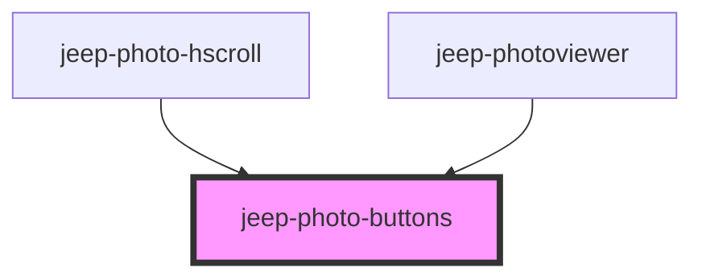

# jeep-photo-buttons

<!-- Auto Generated Below -->

## Properties

| Property        | Attribute       | Description                  | Type     | Default     |
| --------------- | --------------- | ---------------------------- | -------- | ----------- |
| `closebutton`   | `closebutton`   | Close button visible         | `string` | `undefined` |
| `fromcomponent` | `fromcomponent` | From component               | `string` | `undefined` |
| `share`         | `sharevisible`  | Share button visible         | `string` | `undefined` |
| `viewmode`      | `viewmode`      | Mode "fullscreen" / "normal" | `string` | `undefined` |

## Events

| Event                        | Description                                         | Type                                  |
| ---------------------------- | --------------------------------------------------- | ------------------------------------- |
| `jeepPhotoButtonsClose`      | Emitted when the close button was clicked           | `CustomEvent<{ component: string; }>` |
| `jeepPhotoButtonsShare`      | Emitted when the share button was clicked           | `CustomEvent<void>`                   |
| `jeepPhotoRequestFullscreen` | Emitted when the fullscreen mode button was clicked | `CustomEvent<void>`                   |
| `jeepPhotoRequestMinimize`   | Emitted when the minimize mode button was clicked   | `CustomEvent<void>`                   |

## Methods

### `init() => Promise<void>`

Method initialize

#### Returns

Type: `Promise<void>`

### `setJeepPhotoButtonsVisibility(state: boolean) => Promise<void>`

Set the Navigation Visibility (visible/hidden)

#### Parameters

| Name    | Type      | Description |
| ------- | --------- | ----------- |
| `state` | `boolean` |             |

#### Returns

Type: `Promise<void>`

### `setPhotoButtons() => Promise<void>`

Set the Photo Buttons.

#### Returns

Type: `Promise<void>`

## Dependencies

### Used by

 - [jeep-photo-hscroll](../jeep-photo-hscroll)
 - [jeep-photoviewer](..)

### Graph

----------------------------------------------

*Built with [StencilJS](https://stenciljs.com/)*
