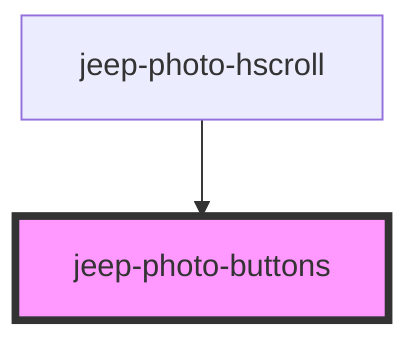

# jeep-photo-buttons

<!-- Auto Generated Below -->

## Properties

| Property   | Attribute      | Description                  | Type     | Default     |
| ---------- | -------------- | ---------------------------- | -------- | ----------- |
| `share`    | `sharevisible` | Share button visible         | `string` | `undefined` |
| `viewmode` | `viewmode`     | Mode "fullscreen" / "normal" | `string` | `undefined` |

## Events

| Event                        | Description                                         | Type                |
| ---------------------------- | --------------------------------------------------- | ------------------- |
| `jeepPhotoButtonsClose`      | Emitted when the close button was clicked           | `CustomEvent<void>` |
| `jeepPhotoButtonsShare`      | Emitted when the share button was clicked           | `CustomEvent<void>` |
| `jeepPhotoRequestFullscreen` | Emitted when the fullscreen mode button was clicked | `CustomEvent<void>` |
| `jeepPhotoRequestMinimize`   | Emitted when the minimize mode button was clicked   | `CustomEvent<void>` |

## Methods

### `init() => Promise<void>`

Method initialize

#### Returns

Type: `Promise<void>`

### `setJeepPhotoButtonsVisibility(state: boolean) => Promise<void>`

Set the Navigation Visibility (visible/hidden)

#### Returns

Type: `Promise<void>`

### `setPhotoButtons() => Promise<void>`

Set the Photo Buttons.

#### Returns

Type: `Promise<void>`

## Dependencies

### Used by

 - [jeep-photo-hscroll](../jeep-photo-hscroll)

### Graph

----------------------------------------------

*Built with [StencilJS](https://stenciljs.com/)*
