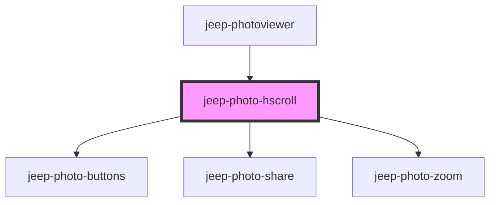

# jeep-photo-hscroll

<!-- Auto Generated Below -->

## Properties

| Property    | Attribute     | Description                                     | Type            | Default     |
| ----------- | ------------- | ----------------------------------------------- | --------------- | ----------- |
| `imageList` | --            | The Image List                                  | `Image[]`       | `undefined` |
| `mode`      | `pvmode`      | The photoviewer mode ('gallery':'one':'slider') | `string`        | `undefined` |
| `options`   | --            | The photoviewer options                         | `ViewerOptions` | `undefined` |
| `position`  | `selposition` | The selected position                           | `number`        | `undefined` |

## Events

| Event                    | Description                                                                 | Type                                 |
| ------------------------ | --------------------------------------------------------------------------- | ------------------------------------ |
| `jeepPhotoHscrollResult` | Emitted when successful or when an error occurs or a message has to be sent | `CustomEvent<JeepPhotoViewerResult>` |
| `jeepPhotoZoom`          |                                                                             | `CustomEvent<{ isZoom: boolean; }>`  |

## Methods

### `init() => Promise<void>`

Method initialize

#### Returns

Type: `Promise<void>`

### `setCarousel() => Promise<void>`

Set the Carousel.

#### Returns

Type: `Promise<void>`

## Dependencies

### Used by

 - [jeep-photoviewer](..)

### Depends on

- [jeep-photo-buttons](../jeep-photo-buttons)
- [jeep-photo-share](../jeep-photo-share)
- [jeep-photo-zoom](../jeep-photo-zoom)

### Graph

----------------------------------------------

*Built with [StencilJS](https://stenciljs.com/)*
