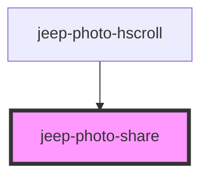

# jeep-photo-share

<!-- Auto Generated Below -->

## Properties

| Property | Attribute | Description              | Type     | Default |
| -------- | --------- | ------------------------ | -------- | ------- |
| `stext`  | `stext`   | The text to share        | `string` | `null`  |
| `stitle` | `stitle`  | The photo title to share | `string` | `null`  |
| `surl`   | `surl`    | The photo url to share   | `string` | `null`  |

## Events

| Event                     | Description                               | Type                                 |
| ------------------------- | ----------------------------------------- | ------------------------------------ |
| `jeepPhotoShareCompleted` | Emitted when the close button was clicked | `CustomEvent<JeepPhotoViewerResult>` |

## Methods

### `init() => Promise<void>`

Method initialize

#### Returns

Type: `Promise<void>`

### `setShare() => Promise<void>`

Set the Share.

#### Returns

Type: `Promise<void>`

## Dependencies

### Used by

 - [jeep-photo-hscroll](../jeep-photo-hscroll)

### Graph

----------------------------------------------

*Built with [StencilJS](https://stenciljs.com/)*
