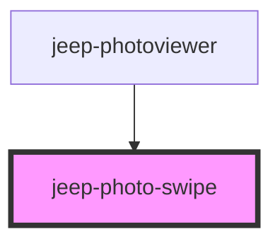

# jeep-photo-zoom

<!-- Auto Generated Below -->

## Properties

| Property        | Attribute       | Description                        | Type     | Default |
| --------------- | --------------- | ---------------------------------- | -------- | ------- |
| `thresholdX`    | `thresholdx`    | The swipe threshold in x direction | `number` | `100`   |
| `thresholdY`    | `thresholdy`    | The swipe threshold in y direction | `number` | `100`   |
| `timeThreshold` | `timethreshold` | The swipe timeThreshold            | `number` | `200`   |

## Events

| Event            | Description                                     | Type                           |
| ---------------- | ----------------------------------------------- | ------------------------------ |
| `jeepSwipeEvent` | Emitted when the user is making a swipe gesture | `CustomEvent<IJeepSwipeEvent>` |

## Methods

### `handleMouseDown(e: any) => Promise<void>`

handleMouseDown

#### Returns

Type: `Promise<void>`

### `handleMouseUp(e: any) => Promise<void>`

handleMouseEUp

#### Returns

Type: `Promise<void>`

### `handleTouchEnd(e: TouchEvent) => Promise<void>`

handleTouchEnd

#### Returns

Type: `Promise<void>`

### `handleTouchStart(e: any) => Promise<void>`

handleTouchStart

#### Returns

Type: `Promise<void>`

### `init() => Promise<void>`

Method initialize

#### Returns

Type: `Promise<void>`

## Dependencies

### Used by

 - [jeep-photoviewer](..)

### Graph

----------------------------------------------

*Built with [StencilJS](https://stenciljs.com/)*
