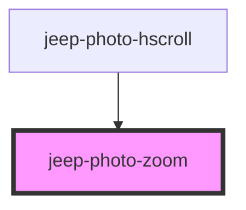

# jeep-photo-zoom

<!-- Auto Generated Below -->

## Properties

| Property       | Attribute      | Description            | Type     | Default     |
| -------------- | -------------- | ---------------------- | -------- | ----------- |
| `maxzoomscale` | `maxzoomscale` | The maximum zoom scale | `number` | `3`         |
| `url`          | `url`          | The photo url          | `string` | `undefined` |

## Events

| Event                 | Description                               | Type                |
| --------------------- | ----------------------------------------- | ------------------- |
| `jeepPhotoZoomOneTap` | Emitted when the close button was clicked | `CustomEvent<void>` |

## Methods

### `init() => Promise<void>`

Method initialize

#### Returns

Type: `Promise<void>`

### `setPhoto() => Promise<void>`

Set the Photo.

#### Returns

Type: `Promise<void>`

## Dependencies

### Used by

 - [jeep-photo-hscroll](../jeep-photo-hscroll)

### Graph

----------------------------------------------

*Built with [StencilJS](https://stenciljs.com/)*
