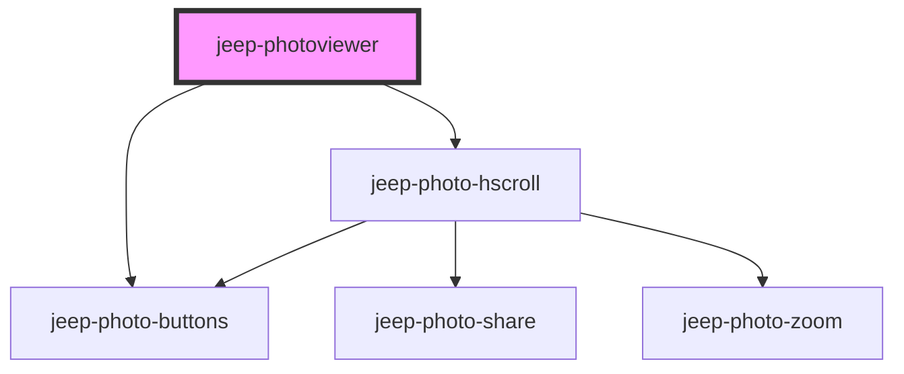

# jeep-photoviewer
Stencil web component using a CSS grid to display a set of images as Gallery and using CSS snap points to walk through images. A selected image can be viewed in `fullscreen` mode with `zoom in/out and pan` capabilities.

The Web component tag is <jeep-photoviewer> which is mainly the Photoviewer Gallery of images and uses the following embedded components:

 - <jeep-photo-hscroll> Horizontal scrolling through images.
 - <jeep-photo-buttons> Set of buttons (`Share` , `Fullscreen`, `Close`)
                        which could be `visible` or `hidden` (Single Tap).
 - <jeep-photo-zoom> Zoom In (Double Tap) / Out (Single Tap) and Pan features.

All components use `Shadow DOM`

## Usage

```html
<!DOCTYPE html>
<html dir="ltr" lang="en">
  <head>
    <meta charset="utf-8" />
    <meta name="viewport" content="width=device-width, initial-scale=1.0, minimum-scale=1.0, maximum-scale=5.0" />
    <title>Stencil Component Starter</title>

    <script type="module" src="https://unpkg.com/jeep-photoviewer/dist/jeep-photoviewer.esm.js"></script>
    <script nomodule src="https://unpkg.com/jeep-photoviewer/dist/jeep-photoviewer.js"></script>
  </head>
  <body>
    <jeep-photoviewer></jeep-photoviewer>
  </body>
  <style>
    body {
      background-color: #000;
    }
  </style>
  <script>
    var cmp = document.querySelector('jeep-photoviewer');
    cmp.imageList = [
    {url: "https://i.ibb.co/wBYDxLq/beach.jpg", title: "Beach Houses"},
            {url: "https://i.ibb.co/gM5NNJX/butterfly.jpg", title: "Butterfly"},
            {url: "https://i.ibb.co/10fFGkZ/car-race.jpg", title: "Car Racing"},
            {url: "https://i.ibb.co/ygqHsHV/coffee-milk.jpg", title: "Coffee with Milk"},
            {url: "https://i.ibb.co/7XqwsLw/fox.jpg", title: "Fox"},
            {url: "https://i.ibb.co/L1m1NxP/girl.jpg", title: "Mountain Girl"},
            {url: "https://i.ibb.co/wc9rSgw/desserts.jpg", title: "Desserts Table"},
            {url: "https://i.picsum.photos/id/1009/5000/7502.jpg?hmac=Uj6crVILzsKbyZreBjHuMiaq_-n30qoHjqP0i7r30r8", title: "Surfer"},
            {url: "https://i.picsum.photos/id/1011/5472/3648.jpg?hmac=Koo9845x2akkVzVFX3xxAc9BCkeGYA9VRVfLE4f0Zzk", title: "On a Lac"},
            {url: "https://i.ibb.co/wdrdpKC/kitten.jpg", title: "Kitten"},
            {url: "https://i.ibb.co/dBCHzXQ/paris.jpg", title: "Paris Eiffel"},
            {url: "https://i.ibb.co/JKB0KPk/pizza.jpg", title: "Pizza Time"},
            {url: "https://i.ibb.co/VYYPZGk/salmon.jpg", title: "Salmon "},
    ];
    const options = {};
    options.maxzoomscale = 3;
    options.compressionquality = 0.6;
    cmp.options = options
  </script>
</html>

```

<!-- Auto Generated Below -->


## Properties

| Property    | Attribute | Description             | Type            | Default     |
| ----------- | --------- | ----------------------- | --------------- | ----------- |
| `imageList` | --        | The Image List          | `Image[]`       | `undefined` |
| `options`   | --        | The photoviewer options | `ViewerOptions` | `undefined` |


## Events

| Event                   | Description                                                             | Type                                 |
| ----------------------- | ----------------------------------------------------------------------- | ------------------------------------ |
| `jeepPhotoViewerResult` | Emitted when successful or when an error occurs or a message to be sent | `CustomEvent<JeepPhotoViewerResult>` |


## Methods

### `closePhotoHScroll() => Promise<void>`


#### Returns

Type: `Promise<void>`


### `init() => Promise<void>`

Method initialize

#### Returns

Type: `Promise<void>`


## Dependencies

### Depends on

- [jeep-photo-hscroll](jeep-photo-hscroll)
- [jeep-photo-buttons](jeep-photo-buttons)

### Graph


----------------------------------------------

*Built with [StencilJS](https://stenciljs.com/)*
